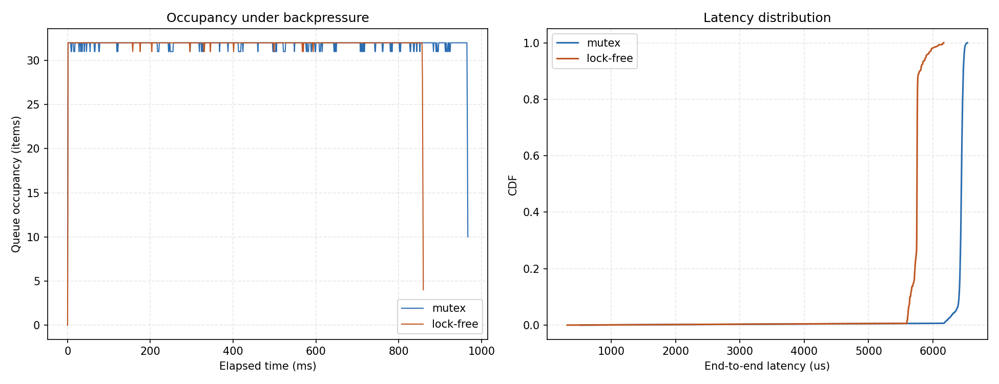

# Concurrent Pipeline with Backpressure: Mutex vs. Lock-Free

A 4-stage concurrent pipeline (`Reader -> Parser -> Filter -> Writer`),
implemented twice with different bounded-queue synchronization strategies,
compared under artificial backpressure. Built to answer a specific
question rather than just implement two textbook primitives: **when the
downstream consumer is slow, does swapping in a lock-free queue actually
help, and what does it cost?**

## TL;DR result

Lock-free wins on raw uncontended throughput but **burns far more CPU
while "blocked"** under sustained backpressure. Measured on a 64-core
node (exa03) with 20,000 records, queue capacity 32, and a 30us
artificial writer delay:

| Queue | Wall time | CPU time | CPU/wall ratio | p50 latency | p99 latency |
|---|---|---|---|---|---|
| Mutex (condvar) | 0.968s | 0.660s | **0.7x** | 6442.7us | 6502.3us |
| Lock-free (spin) | 0.861s | 2.627s | **3.1x** | 5752.5us | 6082.8us |

The mutex version's blocked threads are genuinely asleep (OS-scheduled
wakeup via `condition_variable`), so CPU time stays below wall time. The
lock-free version's blocked threads spin continuously while waiting —
with three intermediate stages (Parser, Filter, Writer) all potentially
spinning on their queues at once while the Writer is the bottleneck, CPU
time balloons to over 3x wall-clock on a machine with enough cores to
hide that cost from a naive throughput-only view. Lock-free does win on
latency here (p99 ~6.08ms vs ~6.50ms) — but at roughly 4x the CPU cost to
get there. **The "lock-free is always faster" intuition doesn't hold once
the system is actually backpressured, and the real cost only shows up if
you measure CPU time, not just wall-clock throughput** — which is the
whole point of building and measuring both instead of just asserting one
is better.

Full test suite (13/13) passes clean under ThreadSanitizer
(`-DSANITIZE=thread`) on exa03, including the SPSC lock-free stress test
— validating the release/acquire memory ordering is actually correct on
real multi-core hardware, not just "happens to work on x86."

